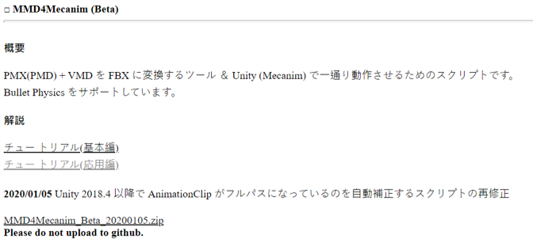
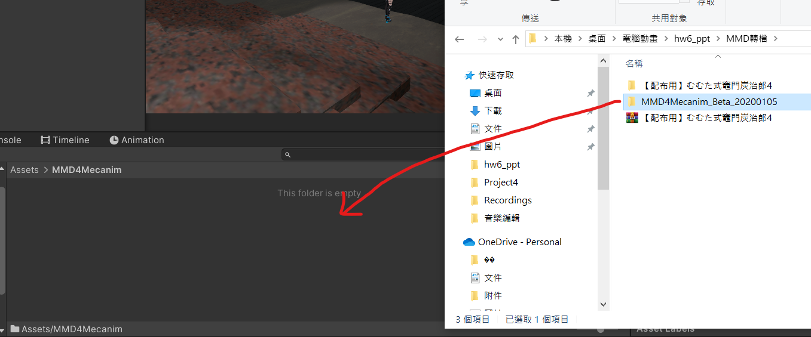

# ca2024fhw06
## 因超過上傳大小請先下載MMD4Mecanim插件
https://stereoarts.jp/
 

 
下載連結：https://stereoarts.jp/MMD4Mecanim_Beta_20200105.zip

## 1. 在Asset中找到“MMD4Mecanim”資料夾 >> 將剛剛下載的MMD4Mecanim插件加到unity

## 2. 在Asset中找到“Scenes”資料夾 >> 打開“HW06_Scene.unity”

